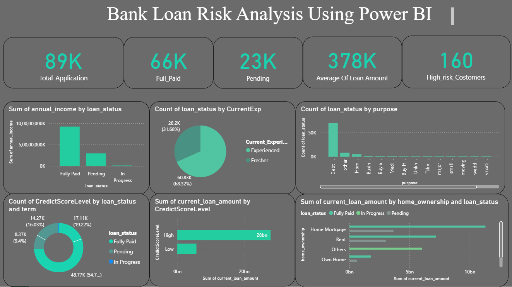

#  Bank Loan Risk Analysis using Power BI

##  Project Overview

This project focuses on analyzing bank customer loan data to identify risk factors that lead to loan approval or rejection. By exploring trends in income, credit scores, bankruptcies, and more, we aim to support banks in making informed, data-driven lending decisions.


##  Objective

- Analyze structured loan application data
- Identify patterns related to loan approvals and defaults
- Visualize key metrics and insights using Power BI
- Help financial institutions reduce loan risk exposure

---

##  Tools & Technologies

-  Python (Pandas, Matplotlib, Seaborn)
-  Power BI
-  Jupyter Notebook
-  CSV File (Cleaned Dataset)
-  GitHub


##  File Structure

```bash
├── Bank_Risk_Analysis.ipynb       # Python code for data cleaning & EDA
├── Cleaned_Bank.csv               # Cleaned dataset used in Power BI
├── PowerBI_Dashboard.pbix         # Interactive dashboard with visuals
├── README.md                      # Project documentation
```


##  Data Preprocessing

- Handled missing values using `fillna()` and column means
- Removed duplicates and irrelevant columns (e.g., loan_id)
- Converted data types where necessary
- Exported cleaned dataset to use in Power BI


##  Power BI Dashboard Features

-  Bar Chart: **Loan Status by Credit Score Group**
-  Pie Chart: **% of Rejected Applicants with Bankruptcy**
- Column Chart: **Sum of Annual Income by Loan Status**
-  Slicers: **Loan Status, Home Ownership, Job Experience**
-  KPI Cards: **Average Loan Amount**, **Approval Rate**, **Avg. Credit Score**




##  Key Insights

-  Credit score below 600 → high rejection rate
-   Income > ₹500,000 → increased approval chances
-  Bankruptcy history → 40% more likely to be rejected
-  Higher monthly debt → increased loan risk


##  Summary

> Performed end-to-end analysis of 30,000+ loan applications using Python and Power BI. Uncovered trends in approval patterns based on credit score, income, and financial history. Built visual dashboards to assist banks in making risk-aware loan decisions.


##  Contact

**Name**: Sakthi Kumar B 

**Email**: b.sakthikumar10@gmail.com
 
**LinkedIn**: [linkedin.com/in/sakthikumar1](https://www.linkedin.com/in/sakthikumar1)  

**GitHub**: [github.com/sakthikumar-1](https://github.com/sakthikumar-1)


## ⭐ Feel free to fork, star or share this repo if you found it useful!
